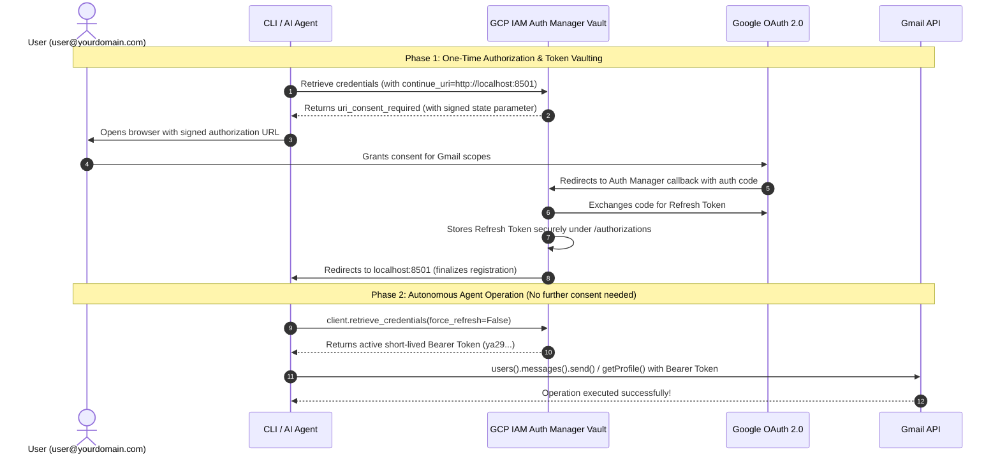

# 🤖 Workspace Gmail Assistant with Google Cloud Agent Identity Auth Manager

A production-ready Google Workspace Gmail AI Agent integration using **Google Cloud IAM Agent Identity Auth Manager** ([Official Documentation](https://docs.cloud.google.com/iam/docs/auth-manager-overview)).

---

## 🌟 Why Agent Identity Auth Manager?

Traditional service accounts require **Domain-Wide Delegation (DWD)** (which grants excessive tenant-wide superadmin privileges) and static **JSON private keys on disk** (which pose severe credential leakage risks).

**Google Cloud Agent Identity Auth Manager replaces DWD and service account keys completely:**
- **No JSON keys on disk**: Everything is authenticated dynamically via Google Cloud IAM.
- **Secure Token Vaulting**: Google Cloud securely stores user refresh tokens inside the GCP IAM vault.
- **On-Demand Short-Lived Tokens**: The AI agent requests scoped, short-lived OAuth 2.0 Bearer access tokens (`ya29...`) on the fly.
- **Principle of Least Privilege**: Access is granted on a per-user, per-scope, and per-agent workload basis.
- **Instant Revocation**: Credentials can be revoked at any time via CLI, API, or `gcloud`.

---

## 📁 Project Structure

```text
workspace-gmail-assistant/
├── auth_manager.py        # Core AgentIdentityAuthManager & AuthManagerCredentials adapter
├── gmail_client.py        # Gmail API client wrapper (messages, drafts, search, profile)
├── agent_tools.py        # Function calling definitions & tool dispatchers for LLM agents
├── adk_agent.py          # Google Agent Development Kit (ADK) agent with GcpAuthProvider
├── deploy_agent.py       # Deployment script for Vertex AI Agent Engines (AGENT_IDENTITY)
├── cli.py                # Full-featured command-line interface for all assistant operations
├── revoke_credentials.py  # Standalone CLI tool to revoke user access from GCP vault
├── test_gmail.py         # Unit tests for auth manager, credentials, and tools
├── preview_diagram.html  # Standalone HTML viewer for architecture diagram
├── requirements.txt      # Python dependencies
├── .env.example          # Template environment variable configuration
└── README.md             # Project documentation and operational guide
```

---

## 🏛️ Architecture & How It Works



> [!TIP]
> You can also open [`preview_diagram.html`](preview_diagram.html) in your browser for a standalone rendered view of this architecture diagram.

---

## 🔐 How Tokens Are Stored & Secured in the Google-Managed Vault

According to [Google Cloud IAM Official Documentation](https://docs.cloud.google.com/iam/docs/auth-manager-overview), the Agent Identity Auth Manager acts as a **centralized, Google-managed credential vault**:

1. **Direct Backend Callback**: The OAuth callback endpoint (`https://agentidentitycredentials.googleapis.com/.../oauthcallback`) terminates directly on Google Cloud's IAM infrastructure. Neither the developer nor the local client ever touches the raw OAuth authorization code or secret tokens during consent.
2. **Server-Side Token Exchange**: The Auth Manager backend directly communicates with Google's OAuth 2.0 token endpoint to exchange the authorization code for a long-lived **Refresh Token**.
3. **Google-Managed Storage & Encryption**:
   - The Refresh Token is stored as an internal `Authorization` resource under your Auth Provider hierarchy (`projects/{project}/locations/{location}/authProviders/{provider}/authorizations/{UUID}`).
   - All vaulted data (API keys, client secrets, and user refresh tokens) is protected with **Google-managed encryption at rest** (the default infrastructure encryption applied across all Google Cloud services).
   - **No JSON keys on disk**: The refresh token never leaves Google's infrastructure and is never written to disk or container storage.
4. **On-Demand Ephemeral Token Minting**:
   - When an authorized agent calls `retrieveCredentials()`, Google Cloud uses the vaulted refresh token to issue a temporary, scoped 1-hour access token (`ya29...`).
   - Token refreshes are handled transparently by Google Cloud in the background.

---

## 📋 Prerequisites

1. **Google Cloud Project**: (e.g. `your-gcp-project-id`)
2. **Google Cloud CLI (`gcloud`)** with `alpha` component installed:
   ```bash
   gcloud components install alpha
   ```
3. **Google Workspace Account**: (e.g. `user@yourdomain.com`)
4. **Enabled Google Cloud APIs**:
   ```bash
   gcloud services enable \
       agentidentity.googleapis.com \
       agentidentitycredentials.googleapis.com \
       gmail.googleapis.com \
       aiplatform.googleapis.com \
       --project="YOUR_PROJECT_ID"
   ```

---

## 🛠️ Step-by-Step Setup Guide

### Step 1: Create OAuth 2.0 Client ID in Google Cloud Console
1. Navigate to **APIs & Services > Credentials** in your GCP Project.
2. Click **Create Credentials > OAuth client ID**.
3. Select **Application Type**: `Web application`.
4. Name: `Gmail Agent Client`.
5. Under **Authorized redirect URIs**, add:
   ```text
   https://agentidentitycredentials.googleapis.com/v1/projects/YOUR_PROJECT_ID/locations/us-central1/authProviders/gmail-agent-auth-provider/oauthcallback
   ```
   *(Replace `YOUR_PROJECT_ID`, `us-central1`, and `gmail-agent-auth-provider` with your actual project, location, and provider name).*
6. Save and copy your **Client ID** and **Client Secret**.

---

### Step 2: Register Auth Provider in Google Cloud
Run the following `gcloud` command to register the Auth Provider in your project:

```bash
gcloud alpha agent-identity auth-providers create gmail-agent-auth-provider \
    --project="YOUR_PROJECT_ID" \
    --location="us-central1" \
    --three-legged-oauth-client-id="YOUR_CLIENT_ID" \
    --three-legged-oauth-client-secret="YOUR_CLIENT_SECRET" \
    --three-legged-oauth-authorization-url="https://accounts.google.com/o/oauth2/v2/auth" \
    --three-legged-oauth-token-url="https://oauth2.googleapis.com/token"
```

---

### Step 3: Grant IAM Permissions
Grant the `roles/agentidentity.user` role to the user or agent workload:

```bash
gcloud alpha agent-identity auth-providers add-iam-policy-binding gmail-agent-auth-provider \
    --project="YOUR_PROJECT_ID" \
    --location="us-central1" \
    --role="roles/agentidentity.user" \
    --member="user:user@yourdomain.com"
```

---

### Step 4: Configure Local Environment
Create your `.env` file from the provided [`.env.example`](.env.example):

```bash
cp .env.example .env
```

Configure your `.env` file:
```env
GOOGLE_CLOUD_PROJECT=your-gcp-project-id
GOOGLE_CLOUD_LOCATION=us-central1
AGENT_AUTH_PROVIDER_NAME=gmail-agent-auth-provider
TARGET_USER_EMAIL=user@yourdomain.com
```

Install Python dependencies:
```bash
pip3 install -r requirements.txt
```

---

### Step 5: Perform One-Time Authorization
Run the interactive CLI authorization flow:

```bash
python3 cli.py authorize
```
- A local callback server starts on port `8501`.
- A browser tab opens preselected for your target account.
- Click **Allow**.
- Credentials and refresh tokens are automatically vaulted in Google Cloud Auth Manager!

---

## 🔍 How to Inspect What Is Stored in Auth Manager

Google Cloud provides dedicated CLI commands to inspect and audit stored credentials.

### 1. View Auth Provider Configuration
Inspect the Auth Provider settings, registered Client ID, and callback URL:
```bash
gcloud alpha agent-identity auth-providers describe gmail-agent-auth-provider \
    --project="YOUR_PROJECT_ID" \
    --location="us-central1"
```

### 2. List All Active User Authorizations
Check which users currently have vaulted credentials in Google Cloud:
```bash
gcloud alpha agent-identity auth-providers authorizations list \
    --auth-provider="gmail-agent-auth-provider" \
    --project="YOUR_PROJECT_ID" \
    --location="us-central1"
```
**Example Output:**
```yaml
---
clientUserId: user@yourdomain.com
createTime: '2026-08-13T04:29:53.828330Z'
name: projects/your-gcp-project-id/locations/us-central1/authProviders/gmail-agent-auth-provider/authorizations/03346ebb-6b1b-4022-9d1b-d99aacd84ff7
scopes:
- https://www.googleapis.com/auth/gmail.compose
- https://www.googleapis.com/auth/gmail.modify
- https://www.googleapis.com/auth/gmail.readonly
- https://www.googleapis.com/auth/gmail.send
state: ACTIVE
updateTime: '2026-08-13T04:35:55.137403Z'
```

### 3. Retrieve Active Bearer Token via CLI
Inspect the short-lived access token retrieved by the client:
```bash
python3 cli.py token
```

---

## 🗑️ How to Revoke Stored Credentials

You can revoke credentials at any time to immediately disconnect access.

### Method 1: Using the CLI
```bash
# Interactive confirmation prompt:
python3 cli.py revoke

# Skip confirmation (-y / --yes):
python3 cli.py revoke -y

# Revoke a specific user:
python3 cli.py revoke --user "user@yourdomain.com" -y
```

### Method 2: Using the Standalone Script
```bash
python3 revoke_credentials.py -y
```

### Method 3: Using `gcloud`
```bash
gcloud alpha agent-identity auth-providers revoke-authorization gmail-agent-auth-provider \
    --project="YOUR_PROJECT_ID" \
    --location="us-central1" \
    --user-id="user@yourdomain.com"
```

### Method 4: Programmatically in Python
```python
from auth_manager import AgentIdentityAuthManager

auth_mgr = AgentIdentityAuthManager()
auth_mgr.revoke_credentials(user_id="user@yourdomain.com")
print("Credentials revoked successfully!")
```

---

## 💻 Full CLI Command Reference

| Command | Description | Example |
| :--- | :--- | :--- |
| `authorize` | Run automated one-time user authorization flow | `python3 cli.py authorize` |
| `token` | Retrieve & display OAuth2 Bearer Access Token | `python3 cli.py token` |
| `profile` | Get Gmail mailbox profile & message count | `python3 cli.py profile` |
| `send` | Send an email via Gmail API | `python3 cli.py send --to "user@example.com" --subject "Hello" --body "World"` |
| `draft` | Create a draft email in Gmail | `python3 cli.py draft --to "user@example.com" --subject "Draft" --body "Text"` |
| `list` | List recent messages | `python3 cli.py list --max 5` |
| `search` | Search messages with Gmail query syntax | `python3 cli.py search "is:unread"` |
| `read` | Read full message content by ID | `python3 cli.py read <MESSAGE_ID>` |
| `labels` | List all mailbox labels | `python3 cli.py labels` |
| `revoke` | Revoke stored user authorization from GCP | `python3 cli.py revoke -y` |
| `setup-guide`| Print all `gcloud` commands for reference | `python3 cli.py setup-guide` |

---

## 🐍 Programmatic Usage (Python SDK)

If you are building custom Python scripts, background services, or standard backend applications without an agent framework, you can use [`auth_manager.py`](auth_manager.py) and [`gmail_client.py`](gmail_client.py) directly:

### 1. Token Management with `AgentIdentityAuthManager`
Retrieve ephemeral Bearer tokens directly from Google Cloud IAM on demand:
```python
from auth_manager import AgentIdentityAuthManager

# Initialize auth manager (reads from .env by default)
auth_mgr = AgentIdentityAuthManager()

# Mint or retrieve the current active Bearer access token
access_token = auth_mgr.get_access_token()
print(f"Active Token: {access_token[:15]}...")

# Inspect full token and provider details
details = auth_mgr.get_token_details()
print(f"Auth Provider: {details['auth_provider']}")
```

### 2. Using `AuthManagerCredentials` with Google API Clients
Seamlessly authenticate standard Google client libraries ([`googleapiclient`](https://github.com/googleapis/google-api-python-client)):
```python
from googleapiclient.discovery import build
from auth_manager import AgentIdentityAuthManager

auth_mgr = AgentIdentityAuthManager()
credentials = auth_mgr.get_google_credentials()

# Build any Google API service (Gmail, Calendar, Drive, etc.)
service = build("gmail", "v1", credentials=credentials)
profile = service.users().getProfile(userId="me").execute()
print(f"Authenticated Account: {profile['emailAddress']}")
```

### 3. High-Level Gmail Operations with `GmailClient`
Perform common mailbox operations with typed helper methods:
```python
from auth_manager import AgentIdentityAuthManager
from gmail_client import GmailClient

auth_mgr = AgentIdentityAuthManager()
client = GmailClient(auth_manager=auth_mgr)

# 1. Send an email
res = client.send_email(
    to="recipient@example.com",
    subject="Automated Update",
    body_text="Hello from Python!",
    body_html="<p>Hello from <b>Python</b>!</p>",
)
print(f"Sent Message ID: {res['id']}")

# 2. Search unread messages
messages = client.list_messages(query="is:unread", max_results=5)
for msg in messages:
    print(f"[{msg['id']}] From: {msg['from']} - Subject: {msg['subject']}")

# 3. Create a draft
draft = client.create_draft(
    to="recipient@example.com",
    subject="Follow-up draft",
    body_text="Draft message body.",
)
print(f"Created Draft ID: {draft['id']}")
```

---

## 🤖 AI Agent Integration & Autonomous Execution

If you are developing AI agents (Gemini, LangChain, Google ADK, or Vertex AI Agent Engines), this repository provides ready-to-use tool declarations, execution bindings, and deployment workflows:

### 1. Function Calling & Tool Declarations ([`agent_tools.py`](agent_tools.py))
Plug standardized Gmail tools into any LLM function-calling framework:
```python
from agent_tools import get_agent_tools, send_gmail_message, search_gmail_messages

# 1. Get OpenAPI / Gemini compatible tool schemas
tool_schemas = get_agent_tools()

# 2. Dispatch tool calls executed by the LLM
result = send_gmail_message(
    to="user@example.com",
    subject="Automated Agent Email",
    body_text="This email was composed by an autonomous AI agent.",
)
print(f"Tool Execution Status: {result['status']}")
```

#### Available Agent Tools
| Agent Tool | Description |
| :--- | :--- |
| [`send_gmail_message`](agent_tools.py) | Send an email with plain text / HTML body and optional CC |
| [`create_gmail_draft`](agent_tools.py) | Create a draft in the user's inbox for human review |
| [`search_gmail_messages`](agent_tools.py) | Search messages using Gmail query syntax (`is:unread`, `from:...`) |
| [`get_gmail_profile`](agent_tools.py) | Fetch user email address and message statistics |
| [`get_workspace_access_token`](agent_tools.py) | Mint active OAuth2 Bearer token from GCP Auth Manager vault |
| [`revoke_workspace_access`](agent_tools.py) | Revoke stored user credentials upon user request |

---

### 2. Google Agent Development Kit ([`adk_agent.py`](adk_agent.py))
Configure an autonomous `LlmAgent` using Google ADK with `GcpAuthProvider` and `AuthenticatedFunctionTool`:
```python
from adk_agent import setup_adk_agent

app, agent = setup_adk_agent(
    project_id="YOUR_PROJECT_ID",
    location="us-central1",
    auth_provider_name="gmail-agent-auth-provider",
    model_name="gemini-2.5-flash",
)
```

---

### 3. Deploying Cloud Agents to Vertex AI Agent Engines ([`deploy_agent.py`](deploy_agent.py))
Deploy remote agents to Google Cloud Vertex AI Agent Engines (Reasoning Engines) with `identity_type=AGENT_IDENTITY`:
```bash
python3 deploy_agent.py \
    --project "YOUR_PROJECT_ID" \
    --location "us-central1" \
    --auth-provider "gmail-agent-auth-provider"
```

Once deployed, grant the `roles/agentidentity.user` IAM role to the agent's workload identity (SPIFFE ID):
```bash
gcloud alpha agent-identity auth-providers add-iam-policy-binding gmail-agent-auth-provider \
    --project="YOUR_PROJECT_ID" \
    --location="us-central1" \
    --role="roles/agentidentity.user" \
    --member="<AGENT_SPIFFE_PRINCIPAL_ID>"
```

---

## 🧪 Running Unit Tests

Run the test suite to verify token retrieval, message encoding, revocation, and tool schemas:

```bash
python3 -m unittest test_gmail.py
```


